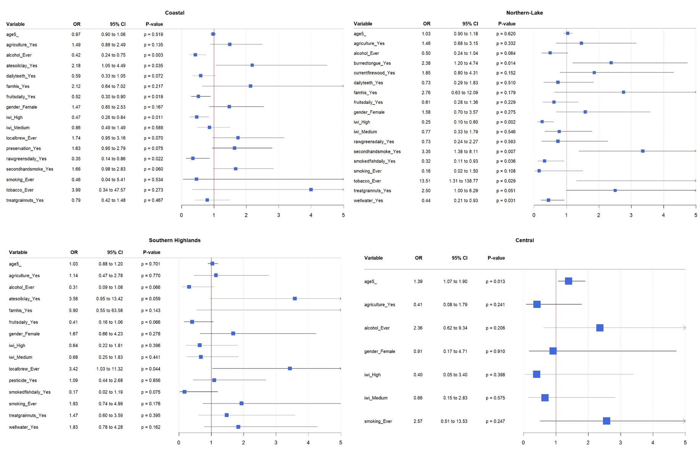

# Hello!

My name is Horace Cheng, and I'm a Masters in Health Data Science student at UCSF. My work includes statistical analyses and exploratory unsupervised learning primarily in R. My current projects are focused on esophageal cancer in Tanzania and exploratory clustering of TCR clone expansion trends, and I have also worked on a project focusing on the use of unsupervised learning to cluster prostate cancer patients as well as on statistical analysis in a project focused on depressive and anxious symptoms in prostate cancer patients.

## Projects

### Region-specific Risk Factors for Esophageal Cancer within Tanzania

A secondary study based on previous case-control data on patients in Tanzania was performed to examine if geographic region has a modifying effect on the associations between risk factors and esophageal cancer (EC). Approximately 900 patients matched as cases and controls were included in the study, and Lasso penalization was used to select for the most impactful variables in each zone. These variables were included in a final zone-specific multivariable logistic regression model along with age, gender, agricultural occupation, IWI, smoking status, and alcohol consumption to calculate odds ratios and examine EC risk.

[Project Repository](https://github.com/hcheng25/ESCC)

## Experience
### Research Intern — _UCSF, San Francisco, CA_

_JAN 2025 - PRESENT_

Working under Dr. Li Zhang performing statistic analyses via R for various health data science projects focused on esophageal cancer and prostate cancer
- Data preprocessing
- Descriptive and inferential statistics
- Logistic regression modeling with variable selection and LASSO penalization
- Generalized linear mixed modeling

### Quality Control Chemist — _BD Biosciences, San Jose, CA_

_AUG 2022 - JUN 2023_

Performed QC testing on genomics reagents according to QC SOP and worked with R&D to validate QC test methods

## Education
### M.S., Health Data Science — _University of California, San Francisco_

_Jul 2024 - Jun 2026_

### B.S., Biochemistry — _Case Western Reserve University, Cleveland, OH_

_Aug 2017 - May 2021_